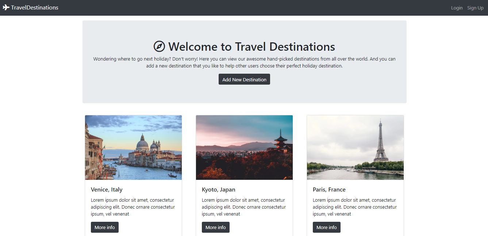

# mapquest-mapbox-mern-travel

# 🚀 Javascript full-stack 🚀

## MERN Stack

### React / Express / MongoDB / Redux

https://github.com/coding-to-music/mapquest-mapbox-mern-travel

https://mapquest-mapbox-mern-travel.herokuapp.com

by Maryam Aljanabi https://github.com/maryamaljanabi

https://github.com/maryamaljanabi/travel-destinations

# Travel Destinations

## Table of contents

- [Introduction](#Introduction)
- [Demo](#demo)
- [Features](#features)
- [Technology](#technology)
- [Run](#run)
- [Sources](#sources)
- [License](#license)

## Introduction

A responsive web application that allows users to add their favorite travel destinations and discover places added by others.

## Demo




This application is deployed on Heroku and can be accessed through the following link:

[Travel Destinations on Heroku](https://travel-destinations.herokuapp.com/)

## Technology

The application is built with:

- Node.js version: 10.16.3
- MongoDB version: 4.2.0
- Express version: 4.17.1
- Bootstrap version: 4.4.1
- FontAwesome version: 5.13.0
- Mapquest API: used for geocoding
- Mapbox API: used to show the maps

## Features

The application allows users to do the following things:

- Create an account, login or logout
- Browse available destinations added by other users
- Check their location on map
- Add, modify, or delete their comments
- Add, modify, or delete their destinations
- A user must be logged in to add a comment or a destination

## Run

To run the application, you have to run npm install to install the required packages in the package.json. Then you have to set your own environmental variables. For security reasons, some variables have been hidden from view and used as environmental variables with the help of dotenv package. Below are the variables that you need to set in order to run the application:

- DATABASEURL: this is the connection string of your MongoDB Atlas database.
- GEOCODER_PROVIDER: the name of the geocoder API that is used to geocode the longitude and latitude entered by users when they create a new destination.
- GEOCODER_API_KEY: the key that you will get when you set up an account for any API that you will use for geocoding.

## Sources

This application was created after finishing [The Web Developer Bootcamp](https://www.udemy.com/course/the-web-developer-bootcamp/) course on Udemy by Colt Steele. In the course, an application called YelpCamp was created, which is similar to this one. The main difference is that YelpCamp used Google maps to show the maps, while TravelDestinations uses Mapquest and Mapbox. The idea of the website is also a bit different.

## License

[](http://badges.mit-license.org)

- MIT License
- Copyright 2020 © [Maryam Aljanabi](https://github.com/maryamaljanabi)

This project was bootstrapped with [Create React App](https://github.com/facebook/create-react-app).

## GitHub

```java
git init
git add .
git remote remove origin
git commit -m "first commit"
git branch -M main
git remote add origin git@github.com:coding-to-music/mapquest-mapbox-mern-travel.git
git push -u origin main
```

## Heroku

```java
heroku create mapquest-mapbox-mern-travel
```

## Heroku MongoDB Environment Variables

```java
heroku config:set

heroku config:set MONGODB_URI="mongodb+srv://<userid>:<password>@cluster0.zadqe.mongodb.net/photo-review-flickr-mern?retryWrites=true&w=majority"

heroku config:set GEOCODER_PROVIDER=""
heroku config:set GEOCODER_API_KEY=""


heroku config:set PUBLIC_URL="https://mapquest-mapbox-mern-travel.herokuapp.com"
```

## Push to Heroku

```java
git push heroku

# or

npm run deploy
```

### Heroku Buildpack

See this repo for more info about setting up a node/react app on heroku:

https://github.com/mars/heroku-cra-node

```java
heroku buildpacks

heroku buildpacks --help

heroku buildpacks:clear

```

```java
heroku buildpacks
```

Output:

```java
=== mapquest-mapbox-mern-travel Buildpack URL
heroku/nodejs
```

### Notice we are doing a SET and then and ADD

```java
heroku buildpacks:set heroku/nodejs

heroku buildpacks:add mars/create-react-app
```

Output:

```java
Buildpack added. Next release on mapquest-mapbox-mern-travel will use:
  1. heroku/nodejs
  2. mars/create-react-app
Run git push heroku main to create a new release using these buildpacks.
```

### Lets try reversing the order

```java
heroku buildpacks:set mars/create-react-app

heroku buildpacks:add heroku/nodejs
```

```java
heroku buildpacks
```

Output:

```java
=== mapquest-mapbox-mern-travel Buildpack URL
heroku/nodejs
```

### Push to Heroku

```
git push heroku
```

## Error:

```java
2022-04-09T03:12:56.076028+00:00 app[web.1]: ls: cannot access '/app/build/static/js/*.js': No such file or directory
2022-04-09T03:12:56.076252+00:00 app[web.1]: Error injecting runtime env: bundle not found '/app/build/static/js/*.js'. See: https://github.com/mars/create-react-app-buildpack/blob/master/README.md#user-content-custom-bundle-location
2022-04-09T03:12:56.253505+00:00 app[web.1]: Starting log redirection...
2022-04-09T03:12:56.253698+00:00 app[web.1]: Starting nginx...
```

Attempted this:

```java
heroku config:set JS_RUNTIME_TARGET_BUNDLE=./client/build/static/js/*.js

heroku config:set JS_RUNTIME_TARGET_BUNDLE=/build/static/js/*.js

# and to remote it:

heroku config:unset JS_RUNTIME_TARGET_BUNDLE

```

## update npm packages

```java
npm install -g npm-check-updates
```

Output:

```java
removed 3 packages, changed 263 packages, and audited 264 packages in 10s

29 packages are looking for funding
  run `npm fund` for details

found 0 vulnerabilities
```

```java
ncu -u
```

Output:

```java
Upgrading /mnt/volume_nyc1_01/mapquest-mapbox-mern-travel/package.json
[====================] 15/15 100%

 axios                ^0.21.0  →  ^0.26.1
 bcrypt                ^5.0.0  →   ^5.0.1
 body-parser          ^1.19.0  →  ^1.20.0
 cookie-parser         ^1.4.5  →   ^1.4.6
 dotenv                ^8.2.0  →  ^16.0.0
 express              ^4.17.1  →  ^4.17.3
 express-fileupload    ^1.2.0  →   ^1.3.1
 js-cookie             ^2.2.1  →   ^3.0.1
 mongoose            ^5.10.13  →  ^6.2.10
 nodemon               ^2.0.6  →  ^2.0.15
 reactjs-popup         ^2.0.4  →   ^2.0.5
 validator           ^13.1.17  →  ^13.7.0

Run npm install to install new versions.
```

```java
npm install
```

Output:

```java
added 58 packages, removed 42 packages, changed 89 packages, and audited 299 packages in 7s

32 packages are looking for funding
  run `npm fund` for details

found 0 vulnerabilities
```

## Client directory

```java
cd client

ncu -u
```

```java
Upgrading /mnt/volume_nyc1_01/mapquest-mapbox-mern-travel/client/package.json
[====================] 18/18 100%

 @testing-library/jest-dom     ^5.11.4  →  ^5.16.4
 @testing-library/react        ^11.1.0  →  ^13.0.0
 @testing-library/user-event  ^12.1.10  →  ^14.0.4
 axios                         ^0.21.0  →  ^0.26.1
 dotenv                         ^8.2.0  →  ^16.0.0
 js-cookie                      ^2.2.1  →   ^3.0.1
 node-sass                     ^4.14.1  →   ^7.0.1
 react                         ^17.0.1  →  ^18.0.0
 react-dom                     ^17.0.1  →  ^18.0.0
 react-redux                    ^7.2.2  →   ^7.2.8
 react-router-dom               ^5.2.0  →   ^6.3.0
 react-scripts                   4.0.0  →    5.0.0
 reactjs-popup                  ^2.0.4  →   ^2.0.5
 redux                          ^4.0.5  →   ^4.1.2
 redux-thunk                    ^2.3.0  →   ^2.4.1
 web-vitals                     ^0.2.4  →   ^2.1.4

Run npm install to install new versions.
```
